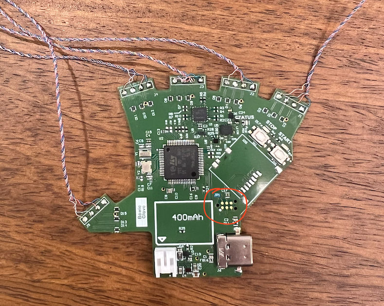
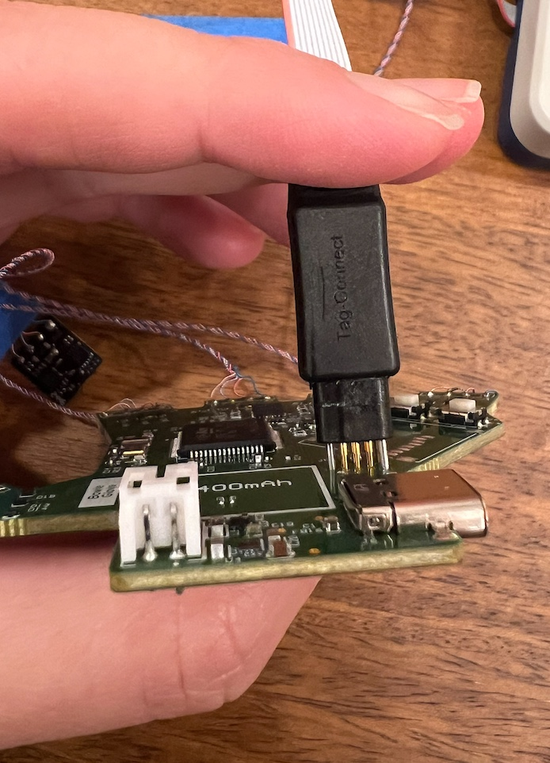

# Flashing OSMO Glove Firmware
This guide will review how to flash the firmware for the OSMO glove. We use a custom firmware for the Bosch magnetometers, which enables unique device addresses to support the large quantity of magnetometers in our system. The firmware is completely open-sourced and can be further developed as needed.

## Required Supplies
### Glove Components
- MCU board with sensor boards soldered and connected

### Equipment
- STLinkV3 Programmer
- TagConnect TC2030-IDC-NL
- USB C - USB A cable*

Install the TagConnect cable on the STLinkV3 programmer.

*Note: USB C - USB A cables are strongly recommended over USB C - USB C cables for interfacing with the glove. Due to stricter data transfer standards with USB A, we can only guarantee reliable funcionality with USB C - USB A cables.

### Software
- [STM32 Cube IDE](https://www.st.com/en/development-tools/stm32cubeide.html) (to view/edit firmware)

## Instructions

### 1. Install the STM32 software.
Installation link: [https://www.st.com/en/development-tools/stm32cubeide.html](https://www.st.com/en/development-tools/stm32cubeide.html).

### 2. Plug in and grant sudo permissions to STLinkV3 programmer.
In Terminal:
```
#list USB devices
lsusb

#look for device
Bus 005 Device 006: ID 0483:374f STMicroelectronics STLINK-V3

#grant permission
#specific example
sudo chmod 777 /dev/bus/usb/005/006

#generic example
sudo chmod 777 /dev/bus/usb/<BUS NUMBER>/<DEVICE NUMBER>
```
### 3. Clone the firmware from the osmo_tactile_glove_code repo.
Firmware folder: [Firmware](https://github.com/jessicayin/osmo_tactile_glove_code/tree/main/firmware)

Note that we have two versions: RTOS and non-RTOS. We aim to have the output message match exactly across the two, you can think of RTOS being the multi-threading version and non-RTOS as the single thread version.

RTOS has the advantage of faster output, currently set at 50Hz. Non-RTOS is easier to work with for debugging/print statements and is more stable. We use the non-RTOS version in the paper. 

### 4. Build the firmware in the STM32 Cube IDE.
Create two separate workspaces, the projects will override each other. Open your STM32CubeIDE workspace and select File --> Import Projects from existing File System. Point the directory location to ../hardware/glove/fw/BowieGlove or ../hardware/glove/fw/BowieGlove_rtos to open the project.

Open the main.c under Core/src/main.c. Select the hammer icon at the top toolbar to build this project. 

### 5. Flash the firmware to the MCU board. 
Plug in the MCU board with the USB C - USB A cable to a power source, such as the computer. The three LEDs on the board should light up briefly. 

Firmly press the TagConnect pins into the MCU board. While maintaining contact and firm pressure, click the green arrow in the IDE to flash the binary to the MCU board.

| Pins Location on MCU | Connecting the TagConnect Cable |
|---|---|
||

### 6. Power cycle and test functionality.
After the flashing is complete, unplug the MCU board from the USB A power source and replug it in. Note that the glove requires approx. 2 minutes to initialize. It is done initilaize when the blue and yellow lights blink rapidly. Test the functionality as follows:
```
#test if device is recognized. if not, the firmware is needs to be flashed again.
lsusb
> Bus 003 Device 014: ID 2833:b015 Oculus VR, Inc. BowieGlove

#find which port it is on
python -m serial.tools.list_ports -v
> /dev/ttyACM0        
    desc: BowieGlove - Data
    hwid: USB VID:PID=2833:B015 SER=123456789 LOCATION=3-3:1.0

#test with basic streaming code
#update the port in glove2robot/utils/bowie.py
python bowie.py

#test with basic visualization in glove2robot/utils/dash_plot_bowie.py
python dash_plot_bowie.py
```
