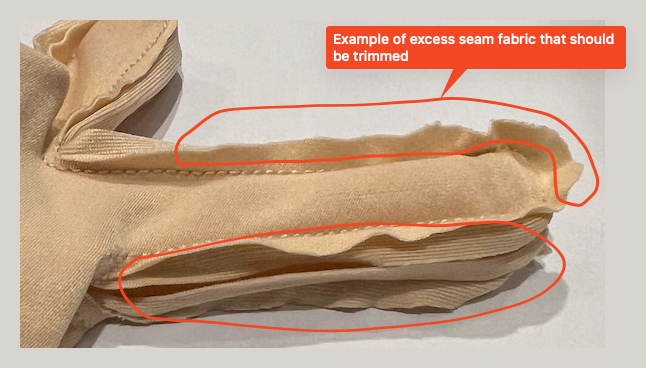
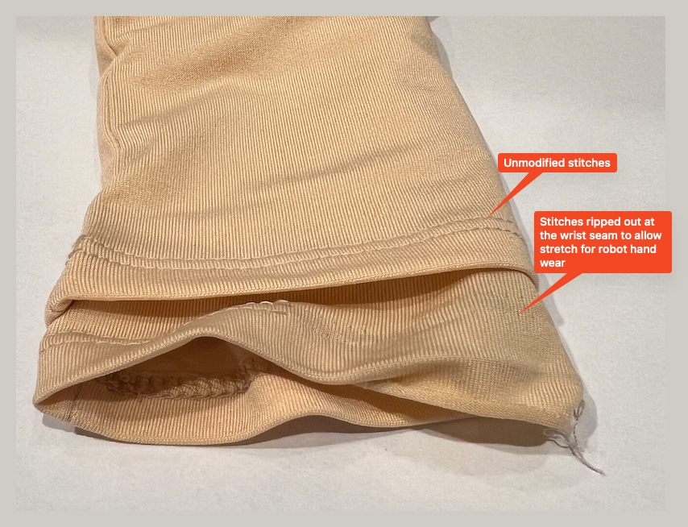
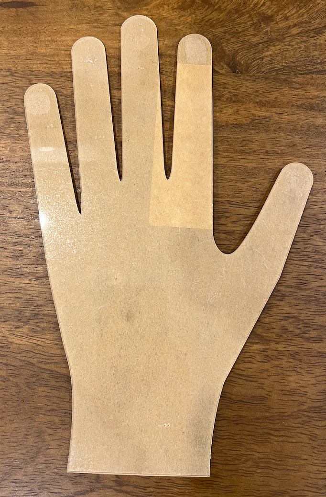
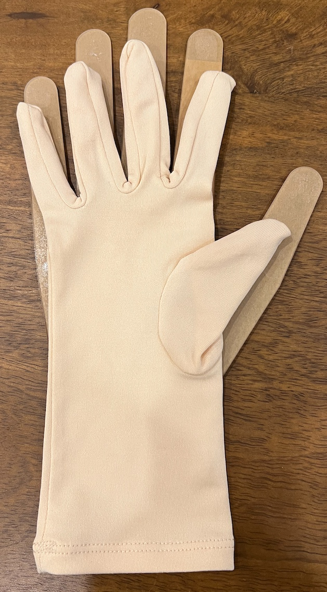
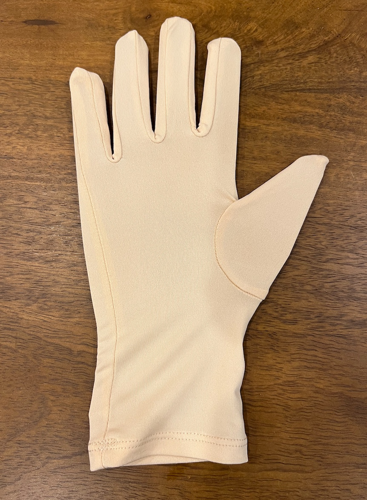
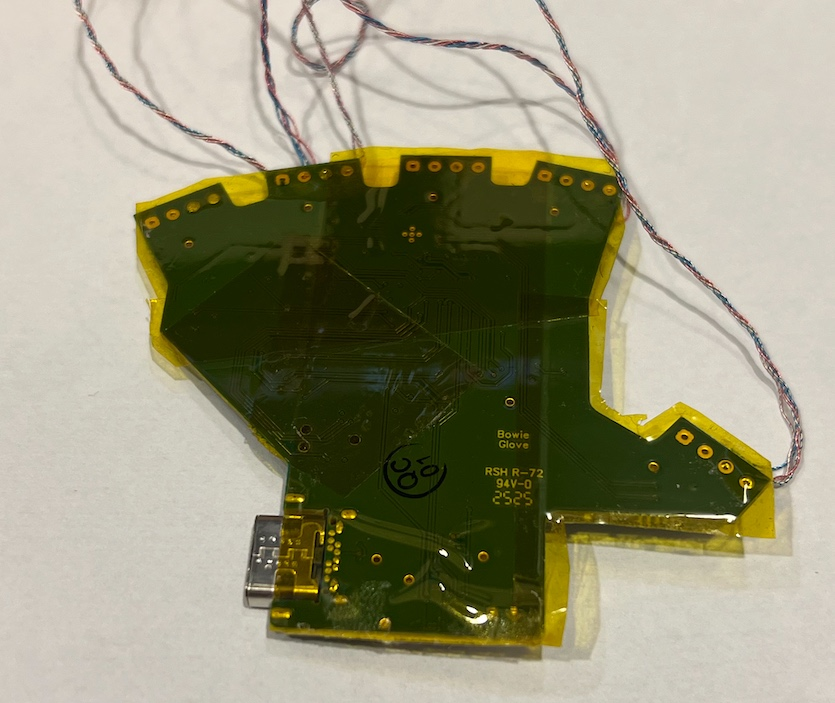
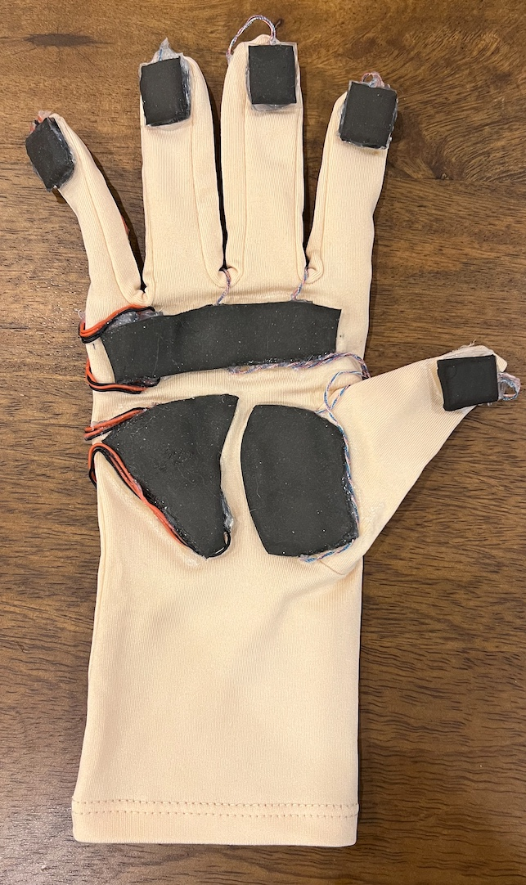
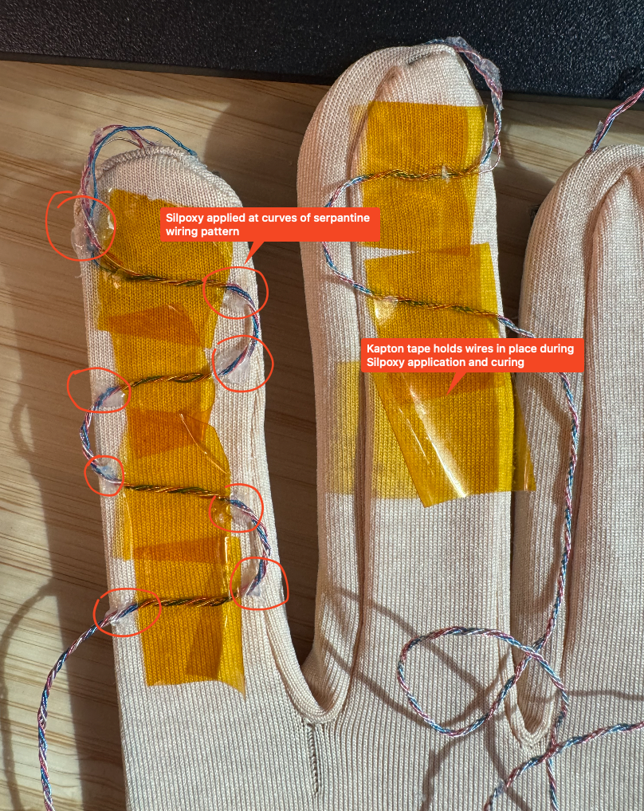
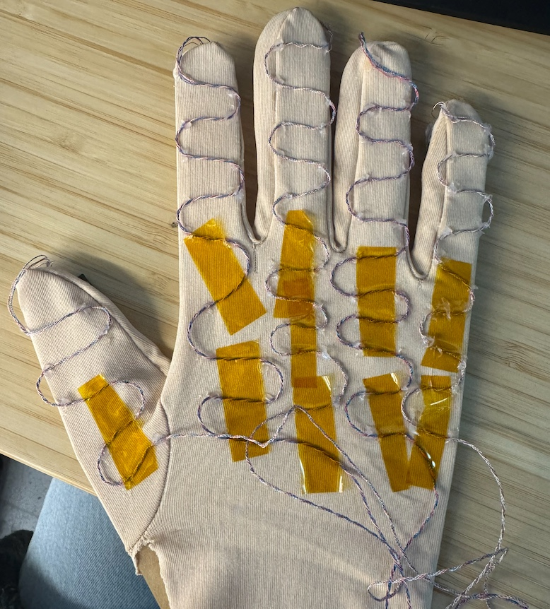

# Glove Assembly Guide
This guide covers how to attach the glove electronics to the fabric base and complete the entire system assembly. We begin by prepping the fabric gloves and the PCBs, glue everything into place, and then place the outer glove over the base glove. This produces one finished OSMO glove.

## Required Supplies
### Glove Components
- 2x beige gloves, one is the base layer and one is the outer layer
- Silpoxy
- Kapton tape
- (Optional, recommended) Laser cut acrylic stencil of a hand

### Equipment
- Scissors
- Cotton tipped applicators

## Instructions

### 1. Prep the base and outer gloves.
Turn the gloves inside out so the internal seams are exposed. Carefully trim the seams close to the stitches to get rid of excess fabric. The excess fabric obstructs the tactile sensors if not removed. 

#### Robot hand prep

If the gloves need to be worn on a robot hand, consider removing the bottom stitching around the wrist with a seam ripper. This will allow the glove to fully stretch to fit over the robot thumb, which usually has a limited range of motion.

### 2. Wear the glove and mark where the sensor should go with a pen.
Mark where the fingertips and major palm regions are on the glove for sensor placement. The glove when laid flat is different than when worn.

### 3. (Optional) Put glove on laser-cut acrylic stencil.
This helps stabilize the shape of the glove during assembly. The stencil should be larger than the glove to keep the fabric taut.

| Stencil | Scale Comparison | Glove on Stencil |
|---|---|---|
|  |  |  |

### 4. Cover back of MCU board with kapton tape.
Cut strips of kapton tape to completely cover the back of the MCU board. This helps protects the MCU board.

### 5. Glue the sensors into position with Silpoxy.
Carefully route the wires such that there are no tangles, which may strain the solder joints as the glove is used. Note how some wires need to be routed to the palmar side of the hand and back to the dorsal side. Glue the sensors into place with Silpoxy and let cure at room temperature for at least 15 minutes.

TODO: detailed wire routing diagram

### 6. Arrange the wires in a serpantine pattern and glue into place.
The serpantine pattern allows the wires to flex with the glove without putting as much strain on the rigid solder joints. Tape the wires to the glove with kapton tape and then apply Silpoxy carefully at the curves of the pattern. Let the Silpoxy cure at room temperature for at least 15 minutes before removing the kapton tape.

| Serpantine Wiring Pattern | Another Example |
|---|---|
|  | 

### 7. Place the outer glove over the base glove, covering the electronics and ensuring an even visual appearance.
Remove the glove from the stencil (if using) and wear it on your hand. Carefully don the outer glove and avoid pulling on the wiring below. Align the fingertips of both gloves and pull into place. No adhesive or other fastening mechanisms are needed to keep the two layers of the glove together. From now on, the dual-layered glove can be gently donned or doffed together in one piece, and the OSMO tactile glove assembly is complete.