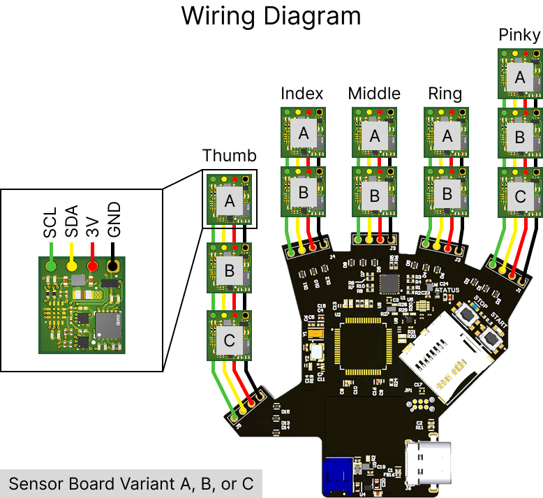
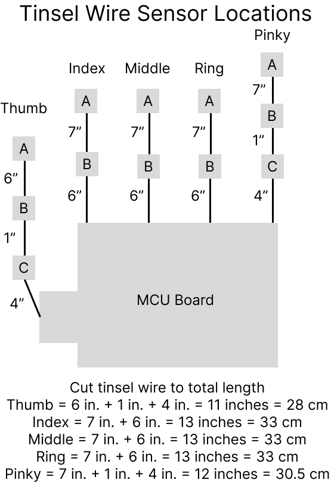

# Sensor Assembly Guide

This guide covers how to assemble the glove electronics. We begin by soldering the sensor and the MCU boards together and then assemble the magnetic tactile sensors. We also review some alternative layouts, such as fingertip-only versions, integration with the Manus glove, and an alternative palm pattern.

## Required Supplies
### Glove Components
- Enameled magnet wire or tinsel wire
- 12 x sensor boards
- 1 x MCU board
- MuMetal sheet
- Magnetic microparticles (Magnequench MQFP-15-7)
- Two part silicone elastomer (Smooth-On Ecoflex 00-30)
- Magnetic elastomer 3D printed molds

### Equipment
- Wire cutters
- Solering iron
- Solder
- Chipquik flux
- Multimeter
- Pulse magnetizer
- Cotton tipped applicators / stir sticks

Note: Please also be prepared to flash the firmware (flash_firmware.md), which happens at step 3.
## Instructions

### 1. Solder the boards together.
Cut the tinsel wire to the total length needed per finger and mark where each sensor should be located on the wire. These are the lengths used in the paper, but feel free to adjust for different sized hands or gloves. If using solder flux, apply to the board and tinsel wire prior to soldering. Solder the sensor boards in series according to the wiring diagram below. 

TIP: Note down somewhere which wire color corresponds to SCL, SDA, 3V, GND for future troubleshooting, and keep these color correspondences consistent both within the same glove build and across future glove builds.

| Glove Wiring | Tinsel Wire |
|---|---|
|  |  |

### 2. Verify soldering with multimeter.
Verify soldering with the multimeter by checking continuity between each of the sensor boards (e.g. A-B, B-C, C-MCU). It can be tricky to solder with tinsel wire even for experienced engineers, and later on the solder joints on the sensor boards will not be accessible to the multimeter. 

### 3. Flash the firmware to verify full functionality.
Please refer to the flash_firmware.md guide. This will verify that the sensors are correctly connected and able to stream data to the MCU board.

### 4. Prepare MuMetal shields.
Cut the MuMetal to 11 mm x 12 mm (same as the size of the sensor board), for each of the sensors (12 total MuMetal shields). The MuMetal can be waterjet for consistency or large batches, or hand-cut with a pair of scissors in a pinch. Lightly buff both sides of the MuMetal shield with sandpaper for better adhesion. 

### 5. Prepare magnetic elastomers.
The magnetic elastomer fabrication follows a similar procedure to [ReSkin](https://reskin.dev/) and [AnySkin](https://any-skin.github.io/). [This video](https://www.youtube.com/watch?v=UBCOBzOkMS0&t=1s) from ReSkin shows how to follow the general fabrication process, although the recipe here is slightly different.
- Measure and pour 8 grams of Ecoflex 00-30 Part A and 8 grams of Ecoflex 00-30 Part B, for a total of 16 grams. Mix well with a stir stick for at least 30 seconds. This needs to be mixed well in order for the silicone to cure properly.
- Measure and pour 16 grams of the magnetic microparticles into the silicone mixture. Hand-mix vigorously for an even distribution of magnetic particles throughout the elastomer.
- Pour the magnetic elastomer mixture into the molds and cure at room temperature.
- Remove the magnetic patches from the modl and trim off any excess with an Xacto knife. 
- Axially magnetize in a pulse magnetizer for 8 seconds at 2kV.

### 6. Assemble magnetic tactile sensors.
First apply a generous, even layer of Silpoxy on the bottom (no chips) side of the PCB and gently press the magnetic elastomer patch into place. Then, apply another generous, even layer of Silpoxy on the MuMetal shield. Align the shield with the board and press into place. Let cure at room temperature (roughly 20-30 minutes).

NOTE: The layers of Silpoxy need to be thick enough to electrically insulate the sensor board from the magnetic elastomer and MuMetal shield, particularly around the solder joints. The Silpoxy layer serves a dual purpose: holding the sensor stack together AND preventing electrical shorts.

### 6. This guide is complete! Please move on to the next tutorial for glove assembly.
Please see glove_assembly.md.

## Alternate Sensor Layouts
TODO

